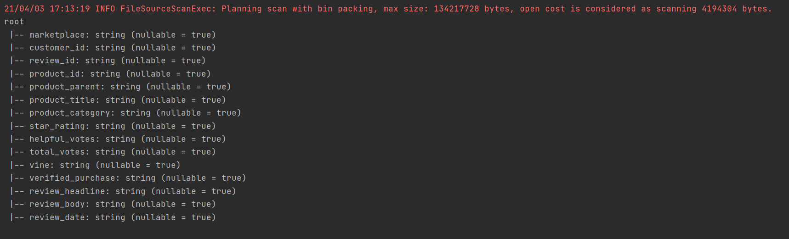

# Deequ_task  
see source ./Deequ_task

Steps:  
- run spark container 
```
docker pull jupyter/all-spark-notebook
docker run -d --name spark -p 8888:8888 -p 4040:4040 jupyter/all-spark-notebook
docker logs spark
http://127.0.0.1:8888/?token=7b0a8f16b8935f94db935d830aaaade490ecffb44ce823d7
```
or if spark is started
```
docker start spark
```
- run shell
```
docker container exec -it spark /bin/sh
```
or open terminal in browser
```
New -> Terminal
```

//- install aws-cli
//```
//pip3 install awscli
//```
//- download deequ and start
//```
//wget https://repo1.maven.org/maven2/com/amazon/deequ/deequ/1.0.1/deequ-1.0.1.jar
//spark-shell --conf spark.jars=deequ-1.0.1.jar
//```

- download 
```
wget https://s3.amazonaws.com/amazon-reviews-pds/tsv/amazon_reviews_us_Camera_v1_00.tsv.gz
```

gzip -d amazon_reviews_us_Camera_v1_00.tsv.gz
val dataset = spark.read.option("sep","\t").option("header","true").option("inferSchema", "true").csv("./amazon_reviews_us_Camera_v1_00.tsv")
dataset.printSchema()

spark-shell --conf spark.jars=deequ-1.1.0_spark-3.0-scala-2.12.jar


