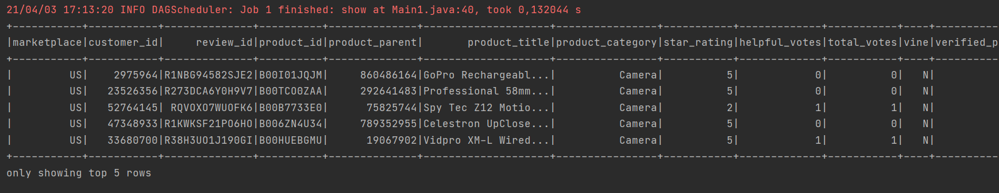

# Deequ_task  
Install:
- install 'spark-2.4.7-bin-hadoop2.7' from https://spark.apache.org/downloads.html
- install 'winutils-master' from https://github.com/cdarlint/winutils
- set system environment variables:
	- JAVA_HOME=path\to\jdk
	- HADOOP_HOME=C:\winutils-master\hadoop-2.7.7\
- clone maven java project, see .'/Deequ_task'
- mvn clean compile for the project
- copy './m2/repository/com/amazon/deequ/deequ/1.1.0_spark-3.0-scala-2.12/deequ-1.1.0_spark-3.0-scala-2.12.jar' to 'C:\spark-2.4.7-bin-hadoop2.7\bin'
- run
```
.\spark-shell --conf spark.jars=deequ-1.1.0_spark-3.0-scala-2.12.jar
```
from spark installation directory
- download tsvfile from https://s3.amazonaws.com/amazon-reviews-pds/tsv/amazon_reviews_us_Camera_v1_00.tsv.gz
- unzip 'amazon_reviews_us_Camera_v1_00.tsv.gz'

__See correct versions in pom.xml. ONLY the versions compatible with the spark and hadoop versions above.__ 

Run class Main1.java  
See full log DeequeTask1Log.txt





# Koalas_task

pdf - pandas data frame  
kdf - koalas data frame  

Provide report with answers to the following questions:  

a.	How to replace NULL in a Koalas Dataframe with specific value?  
```
kdf.fillna(value=5)
```
b.	How to quickly collect stats for Pandas/Koalas Dataframe?  
```
pdf.describe()
kdf.describe()
```
c.	How to perform left outer join between Koalas dataframes df1 and df2 by id column?  
```
dfl = ks.DataFrame(
    {'id': [1, 2, 3, 4, 5, 6],
     'b': [100, 200, 300, 400, 500, 600],
     'c': ["one", "two", "three", "four", "five", "six"]})
dfl.set_index('id')

df2 = ks.DataFrame(
    {'id': [1, 2, 2, 2, 5, 6],
     'b': [100, 300, 300, 300, 500, 600],
     'c': ["one", "two", "three", "four", "five", "six"]})
df2.set_index('id')

join_df = dfl.join(df2, how='left', lsuffix='_left', rsuffix='_right')
join_kdf
```


d.	What are use cases for Pandas Dataframe and for Koalas Dataframe?  

A Koalas DataFrame is distributed, which means the data is partitioned and computed across different workers.  
On the other hand, all the data in a pandas DataFrame fits in a single machine.

e.	What Koalas Dataframe’s Index is used for? What is Spark analogue of Koalas Dataframe’s Index (if any)?  

Index is the key to your table and if we know the index, then we can easily grab the row that holds our data using .loc.  
the data in a Spark dataframe is not ordered, it has no intrinsic notion of index.  


