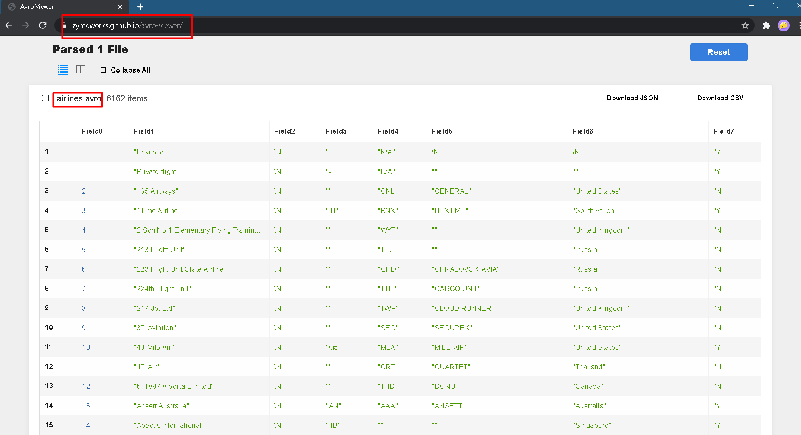

## HDFS_task_manual

download data from https://openflights.org/data.html  

1.	Create HDFS directory /user/student and nested directories airports, airlines, routes, planes, countries

```
//hadoop fs –mkdir /user/student  
hadoop fs –mkdir -p /user/student/airports  
hadoop fs –mkdir -p /user/student/airlines  
hadoop fs –mkdir -p /user/student/routes  
hadoop fs –mkdir -p /user/student/planes  
hadoop fs –mkdir -p /user/student/countries  
```


2.	Copy each file from the local file system's airlines dataset to the corresponding HDFS directory created in step #1 
(i.e. routes.dat should be stored HDFS as /user/student/routes/routes.dat) 

```
hadoop fs –put airports.dat /user/student/airports/airports.dat  
hadoop fs –put airlines.dat /user/student/airlines/airlines.dat  
hadoop fs –put routes.dat /user/student/routes/routes.dat  
hadoop fs –put planes.dat /user/student/planes/planes.dat  
hadoop fs –put countries.dat /user/student/countries/countries.dat  
```


3.	Print out to the console first 9 lines of /user/student/countries/countries.dat file

```
hadoop fs -cat /user/student/countries/countries.dat | head -9  
```


4.	Compare MD5 checksums between the local file airports.dat and HDFS file /user/student/airports/airports.dat. Is there any difference?

[cloudera@quickstart student]$ md5sum airports.dat  
acfcde754e66b4f224562fa74b567b2b airports.dat  
[ctoudera@quickstart studentl$ hadoop fs -cat /user/student/airports/airports.dat | md5sum  
acfcde754e66b4f224562fa74b567b2b  


[cloudera@quickstart student]$ hdfs dfs -checksum /user/student/airports/airports.dat  
/user/student/airports/airports.dat	MD5-of-0MD5-of-512CRC32C	000002000000000000000000a4129426226faee1719fb3c00d055f16


Here extra examples of command
```
[cloudera@quickstart Downloads]$ hadoop fs -checksum hdfs://quickstart.cloudera/user/student/airports/airports.dat
hdfs://quickstart.cloudera/user/student/airports/airports.dat	MD5-of-0MD5-of-512CRC32C	000002000000000000000000a4129426226faee1719fb3c00d055f16

[cloudera@quickstart Downloads]$ hadoop fs -checksum /user/student/airports/airports.dat
/user/student/airports/airports.dat	MD5-of-0MD5-of-512CRC32C	000002000000000000000000a4129426226faee1719fb3c00d055f16

[cloudera@quickstart Downloads]$ hadoop fs -checksum hdfs://0.0.0.0/user/student/airports/airports.dat
hdfs://0.0.0.0/user/student/airports/airports.dat	MD5-of-0MD5-of-512CRC32C	000002000000000000000000a4129426226faee1719fb3c00d055f16
```
These examples do not work
```
hadoop fs -checksum file:///home/cloudera/Downloads/airports.dat
hadoop fs -checksum file:///user/student/airports/airports.dat
```

5.	How much replicas does the /user/student/airports/airports.dat file have? Set number of replicas to 4 for the file


6.	Print out the total size of the /user/student dir in megabytes. 
Why the space consumed by the directory in HDFS doesn't equal to the space consumed by the same directory in local FS?

Because dhfs has cluster's file size 64 MB or 128 MB whereas ext4 cluster has range from 1KB


7.	Run the filesystem checking utility for the /user directory in HDFS. 
Analyze utility's output in order to answer the following questions:
•	Are there any corrupted files and blocks?

Corrupt blocks: 0

•	Are there any missed blocks?

Mis-replicated blocks: 0

•	How HDFS is configured? How many Data Nodes and Racks are in place?

Number of data-nodes: 1
Number of racks: 1

•	Where the blocks are located? (block path)


> hdfs fsck /user  

## HDFS_task_automation

python script в директории /hdfs/main.py

- чтение airlines.dat из hdfs
- сохранение airlines.csv
- конвертирование airlines.csv в airlines.avro
- запись airlines.avro в hdfs




