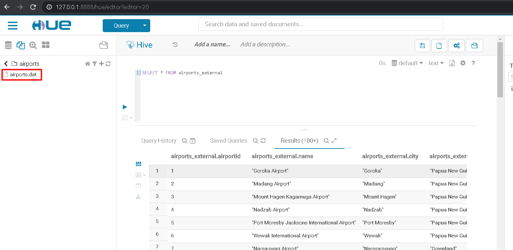
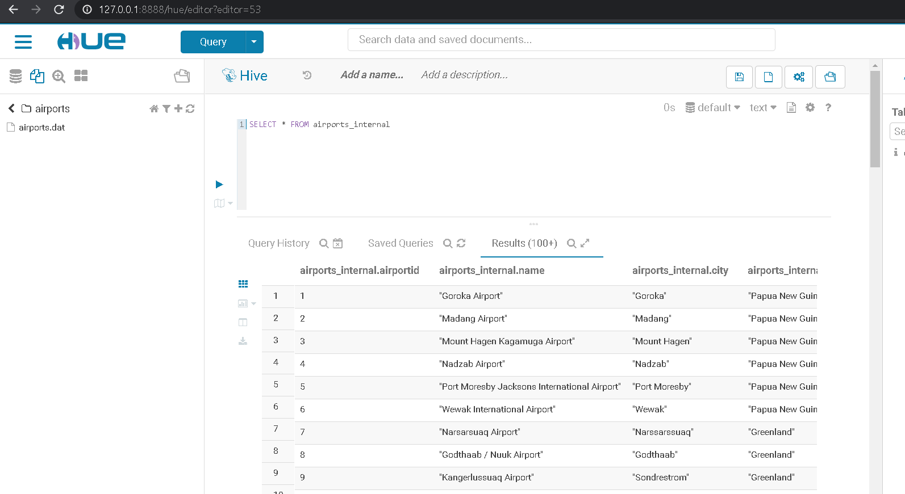
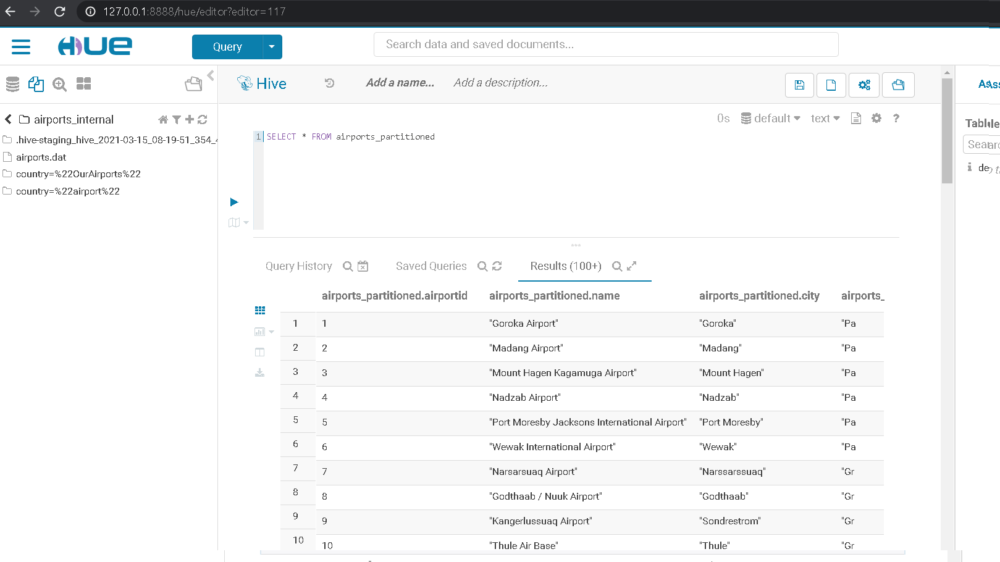
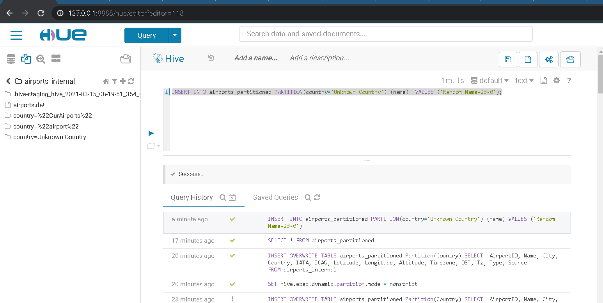
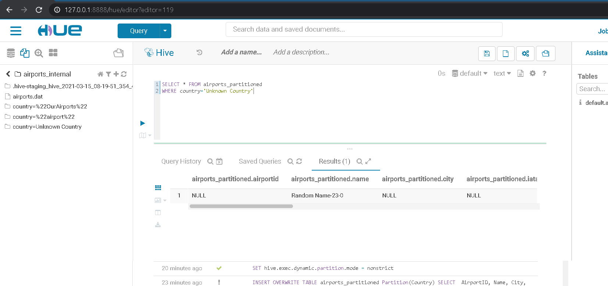
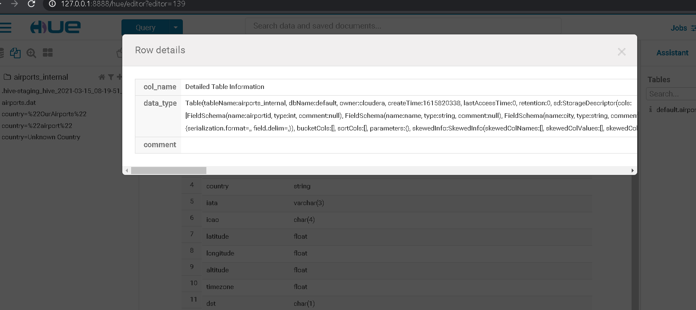
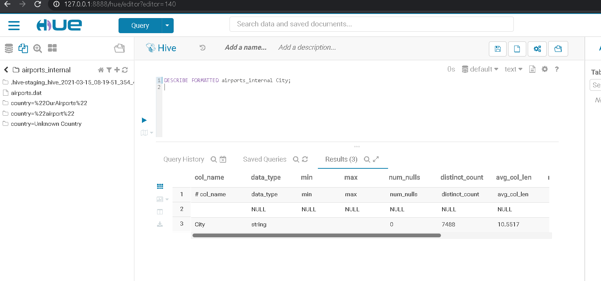

# Task 1:  
Create external Hive table named airports_external from the airports.dat file from https://openflights.org/data.html dataset  
- Use proper data type for every specific column  
- Handle NULL values correctly  
- Notice and explore if there are any changes in /user/hive/warehouse dir in HDFS (attach screenshot to the report)  

```
--CREATE TABLE 
CREATE EXTERNAL TABLE IF NOT EXISTS airports_external (
    AirportID INT,
    Name STRING,
    City STRING,
    Country STRING,
    IATA CHAR(3),
    ICAO CHAR(4),
    Latitude FLOAT,
    Longitude FLOAT,
    Altitude FLOAT,
    Timezone FLOAT,
    DST CHAR(1),
    Tz STRING,
    Type STRING,
    Source STRING
)  
ROW FORMAT DELIMITED FIELDS TERMINATED BY ','
STORED AS TEXTFILE
LOCATION '/user/student/airports'
TBLPROPERTIES ('serialization.null.format'='');

--SHOW TABLE
SELECT * FROM airports_external
```




/user/hive/warehouse dir in HDFS is EMPTY  


# Task 2:
Create managed table named airports_internal with columns airport_id,name,city,country,timezone,tz as select from airports_external  
- airports_internal table must not have rows which IATA code is NULL  
- The table must be stored as a text file with ‘|’ character as a column separator  
- Notice and explore if there are any changes in /user/hive/warehouse dir in HDFS (attach screenshot to the report)  

```
--CREATE TABLE 
CREATE TABLE IF NOT EXISTS airports_internal (
    AirportID INT,
    Name STRING,
    City STRING,
    Country STRING,
    IATA VARCHAR(3),
    ICAO CHAR(4),
    Latitude FLOAT,
    Longitude FLOAT,
    Altitude FLOAT,
    Timezone FLOAT,
    DST CHAR(1),
    Tz STRING,
    Type STRING,
    Source STRING
)  
ROW FORMAT DELIMITED FIELDS TERMINATED BY ',';

LOAD DATA LOCAL INPATH '/home/cloudera/Documents/student/airports.dat' INTO TABLE airports_internal
```




# Task 3:
Create external table airports_partitioned dynamically partitioned by country and bucketed by city from the airports_internal table
- External table’s data must be stored at /user/hive/warehouse/airports_partitioned dir
- Table must be bucketed by 4 buckets
- Notice and explore if there are any changes in /user/hive/warehouse dir in HDFS (attach screenshot to the report)

```
CREATE EXTERNAL TABLE IF NOT EXISTS airports_partitioned (
    AirportID INT,
    Name STRING,
    City STRING,
    IATA CHAR(3),
    ICAO CHAR(4),
    Latitude FLOAT,
    Longitude FLOAT,
    Altitude FLOAT,
    Timezone FLOAT,
    DST CHAR(1),
    Tz STRING,
    Type STRING,
    Source STRING
)  
PARTITIONED BY (Country STRING)
CLUSTERED BY (City) INTO 4 BUCKETS
ROW FORMAT DELIMITED FIELDS TERMINATED BY ','
STORED AS TEXTFILE;

SET hive.exec.dynamic.partition = true;
SET hive.exec.dynamic.partition.mode = nonstrict;

INSERT OVERWRITE TABLE airports_partitioned Partition(Country) 
SELECT 
   AirportID,
   Name,
   City,
   Country,
   IATA,
   ICAO,
   Latitude,
   Longitude,
   Altitude,
   Timezone,
   DST,
   Tz,
   Type,
   Source
FROM airports_internal;
```




# Task 4:  
Update table airports_partitioned by inserting new row  
- Row should be statically partitioned by country column using “Unknown Country” value  
- Other fields’ values may be random  
- Notice and explore if there are any changes in /user/hive/warehouse dir in HDFS (attach screenshot to the report)  
- Check if the inserted record available for select  

```
INSERT INTO airports_partitioned PARTITION(country='Unknown Country') (name)  VALUES ('Random Name-23-0');
```





# Task 5:
Create table airports_avro stored in AVRO format and airports_parquet stored in  Parquet format from the airports_external table  
- Notice and explore if there are any changes in /user/hive/warehouse dir in HDFS (attach screenshot to the report)  
- Compare size of resulting Parquet/AVRO files and source CSV file  

```
CREATE TABLE airports_avro 
    row format delimited 
    fields terminated by ',' 
    STORED AS AVRO 
AS select * from airports_external
```


```
CREATE TABLE airports_parquet
    row format delimited 
    fields terminated by ',' 
    STORED AS PARQUET 
AS select * from airports_external
```


csv_size = 1.08 MB  
avro_size = 986.02 KB  
parquet_size = 504.59 KB  


# Task 6:
Convert AVRO file stored in /user/hive/warehouse/airports_avro to JSON file  
- Hint: use avro-tools

```
java -jar ./avro-tools-1.10.1.jar tojson ./000000_0 > ./airports.json
```

see dir ./task6 
file 'airports.json'

# Task 7:
Create external table with name ipinyou_external and schema ip string, region_id int, city int from iPinYou dataset using RegexSerDe  
- See iPinYou dataset description at Table 3 of the page 4 here: http://contest.ipinyou.com/ipinyou-dataset.pdf  

```
CREATE EXTERNAL TABLE IF NOT EXISTS ipinyou_external (
    IP STRING,
    RegionID STRING,
    CityID STRING
)  
ROW FORMAT SERDE 'org.apache.hadoop.hive.contrib.serde2.RegexSerDe'
WITH SERDEPROPERTIES(
    "input.regex" = "^.*(\\d{1,3}\\.\\d{1,3}\\.\\d{1,3}\\.\\*)\\t(\\d{1,3})\\t(\\d{1,3}).*$"
) 
STORED AS TEXTFILE
LOCATION '/user/student/ipinyou_dataset';
```


# Task 8

```
ANALYZE TABLE airports_internal COMPUTE STATISTICS;
DESCRIBE airports_internal;
```



```
ANALYZE TABLE airports_internal COMPUTE STATISTICS for COLUMNS City;
DESCRIBE FORMATTED airports_internal City;
```



# Task 9

```
drop table airports_external;
drop table airports_internal;
drop table airports_partitioned;
drop table airports_avro;
drop table airports_parquet;
```


