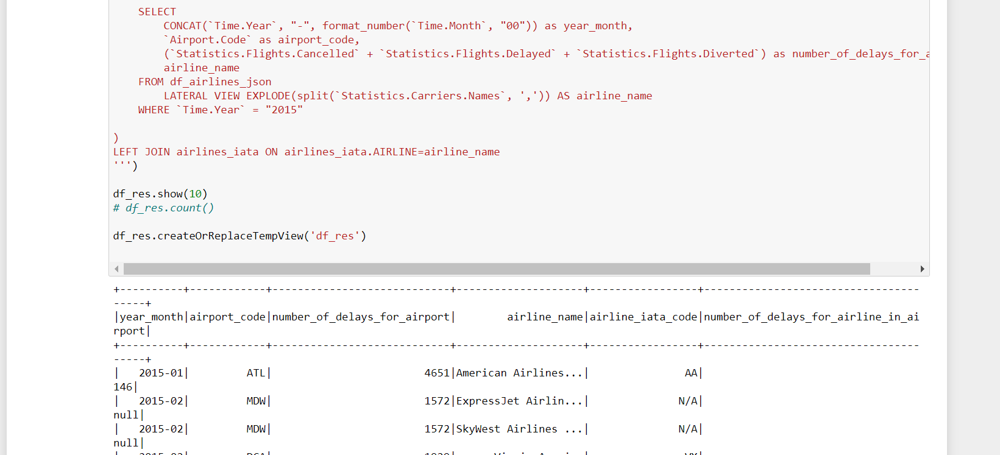

###	 PRECONDITIONS

* Execute 
docker pull jupyter/all-spark-notebook
docker run -p 8888:8888 -p 4040:4040 jupyter/all-spark-notebook
open http://127.0.0.1:8888/?token=fb520c3e63a255a2968c7a3f1af91e2304044462d8e34816

* get config by python from notebook
from pyspark.sql import SparkSession
spark = SparkSession.builder.getOrCreate()
spark.sparkContext.getConf().getAll()

* upload all files (including zip) by button Upload in notebook

* unzip golden_dataset.zip by terminal in notebook
unzip golden_dataset.zip -d ./golden_dataset
unzip flights.csv.zip

* read schemas of csv
df = spark.read.option("header",True).csv("./airports.csv")
df.printSchema()

* read data of csv
df = spark.read.option('sep',',').option("header",True).csv("./flights.csv")
df.show()

* read schemas of parquet
df = spark.read.parquet('golden_dataset/query1')
df.printSchema()

* read data of parquet
df.show()


## Task #1. Query #1:

### 1.2. Implement each query using Spark Dataframe API

```
from pyspark.sql import SparkSession

spark = SparkSession.builder.getOrCreate()
spark.sparkContext.getConf().getAll()

df_csv = spark.read.option('sep',',').option("header",True).option("inferSchema", True).csv("./flights.csv")
# df_csv = spark.read.option('sep',',').option("header",True).csv("./flights.csv")

df = df_csv

df.printSchema()


from pyspark.sql.functions import concat_ws
import pyspark.sql.functions as F
from pyspark.sql.window import Window

dfr1 = df\
.select(
    concat_ws(
        "-",
        F.format_string('%04d', df['YEAR']),
        F.format_string('%02d', df['MONTH']),
        F.format_string('%02d', df['DAY'])
    )
    .alias('departure_date'),
#     df['SCHEDULED_DEPARTURE'],
#     df['DEPARTURE_TIME'],
    F.when(F.col("DEPARTURE_TIME").isNull(), '00:00:00')
    .otherwise(
        concat_ws(
            ":",
            F.format_string('%02d', F.floor(df['DEPARTURE_TIME']/100)), 
            F.format_string('%02d', df['DEPARTURE_TIME']%100), 
            F.lit("00")
        )
    )
    .alias('departure_time'),
    df['AIRLINE'].alias('airline'),
    df['FLIGHT_NUMBER'].alias('flight_number'),
)
# .where(df['SCHEDULED_DEPARTURE'].between(59,101) )
# .orderBy(['departure_date', 'departure_time_f'])

# dfr.show(100)

dfr2 = dfr1\
.withColumn(
    'daily_flight_serial_number',
    F.row_number().over(
        Window.partitionBy('departure_date').orderBy('departure_time')
    )
)\
.withColumn(
    'airline_daily_flights_count', 
    F.count('*').over(
        Window.partitionBy('departure_date', 'airline')
    )
)\
.withColumn(
    'time_since_previous_departure',
    F.floor(
        (
            F.unix_timestamp('departure_time', 'HH:mm:ss') - F.lag(F.unix_timestamp('departure_time', 'HH:mm:ss'))
            .over(
                Window.partitionBy('departure_date', 'airline').orderBy('departure_time')
            )
        ) / 60
    )
)\
.orderBy(['departure_date', 'daily_flight_serial_number'])\
.show(100)
```


### 1.2.2. Compare query results with golden dataset (to be provided) using Spark Dataframe API. It's allowed to use EXCEPT clause

```
diff = dfr2.subtract(df_parquet)
diff.count()

diff.toPandas().to_csv('diff.csv')
diff.write.parquet("diff.parquet")
```


### 1.2.3. Save difference between datasets (if any) to both Excel and Parquet files

```
import pandas as pd 
import numpy as np 

# Reading the csv file 
df_csv = pd.read_csv('diff.csv') 
  
# saving xlsx file 
xlsx_writer = pd.ExcelWriter('diff.xlsx') 
df_csv.to_excel(GFG, index = False) 
  
xlsx_writer.save() 
```


### 1.2.4. Create test report consisting of:
	- Spark Dataframe API query
	- datasets comparison query
	- difference between datasets' rows in Excel format
	- difference between datasets' rows in Parquet format
	
```
diff.describe().show()
diff.summary().show()
```


## Tasks #1. Query #2Query #2:

### 1.1. Implement each query in Spark SQL (see org.apache.spark.sql.SparkSession#sql)

```
import pyspark.sql.functions as F

df_json = spark.read.option('multiline', True).json('airlines.json')

df = df_json.select(
    F.col('Airport.Code').alias('Airport.Code'),
    F.col('Airport.Name').alias('Airport.Name'),

    F.col('Time.Label').alias('Airport.Code'),
    F.col('Time.Month').alias('Airport.Name'),
    F.col('Time.Month Name').alias('Airport.Month Name'),
    F.col('Time.Year').alias('Airport.Year'),
    
    F.col('Statistics.# of Delays.Carrier').alias('Statistics.# of Delays.Carrier'),
    F.col('Statistics.# of Delays.Late Aircraft').alias('Statistics.# of Delays.Late Aircraft'),
    F.col('Statistics.# of Delays.National Aviation System').alias('Statistics.# of Delays.National Aviation System'),
    F.col('Statistics.# of Delays.Security').alias('Statistics.# of Delays.Security'),
    F.col('Statistics.# of Delays.Weather').alias('Statistics.# of Delays.Weather'),

    F.col('Statistics.Carriers.Names').alias('Statistics.Carriers.Names'),
    F.col('Statistics.Carriers.Total').alias('Statistics.Carriers.Total'),

    F.col('Statistics.Flights.Cancelled').alias('Statistics.Flights.Cancelled'),
    F.col('Statistics.Flights.Delayed').alias('Statistics.Flights.Delayed'),
    F.col('Statistics.Flights.Diverted').alias('Statistics.Flights.Diverted'),
    F.col('Statistics.Flights.On Time').alias('Statistics.Flights.On Time'),
    F.col('Statistics.Flights.Total').alias('Statistics.Flights.Total'),
    
    F.col('Statistics.Minutes Delayed.Carrier').alias('Statistics.Minutes Delayed.Carrier'),
    F.col('Statistics.Minutes Delayed.Late Aircraft').alias('Statistics.Minutes Delayed.Late Aircraft'),
    F.col('Statistics.Minutes Delayed.National Aviation System').alias('Statistics.Minutes Delayed.National Aviation System'),
    F.col('Statistics.Minutes Delayed.Security').alias('Statistics.Minutes Delayed.Security'),
    F.col('Statistics.Minutes Delayed.Total').alias('Statistics.Minutes Delayed.Total'),
    F.col('Statistics.Minutes Delayed.Weather').alias('Statistics.Minutes Delayed.Weather'),
)

df_res = spark.sql('''
SELECT 
    year_month,
    airport_code,
    number_of_delays_for_airport,
    airline_name,
    ifnull(airlines_iata.IATA_CODE, "N/A") as airline_iata_code,
    CASE 
        WHEN airlines_iata.IATA_CODE is null 
        THEN null 
        ELSE (
            SELECT 
                count(*)
            FROM
                flights_csv
            WHERE 
                year_month = CONCAT(`YEAR`, "-", format_number(`MONTH`, "00")) and 
                    AIRLINE=airlines_iata.IATA_CODE and 
                    ORIGIN_AIRPORT = airport_code and (
                        ((DEPARTURE_DELAY > 0 AND ARRIVAL_DELAY > 0) OR (CANCELLED != 0)) 
                    )
            GROUP BY AIRLINE 
            ) + (
            SELECT 
                count(*)
            FROM
                flights_csv
            WHERE 
                year_month = CONCAT(`YEAR`, "-", format_number(`MONTH`, "00")) and
                AIRLINE=airlines_iata.IATA_CODE and
                DESTINATION_AIRPORT = airport_code and (
                    ((DEPARTURE_DELAY <= 0 AND ARRIVAL_DELAY > 0) OR (DIVERTED != 0))
                )
            GROUP BY AIRLINE
            )
    END AS number_of_delays_for_airline_in_airport
FROM (

    SELECT 
        CONCAT(`Time.Year`, "-", format_number(`Time.Month`, "00")) as year_month,
        `Airport.Code` as airport_code,
        (`Statistics.Flights.Cancelled` + `Statistics.Flights.Delayed` + `Statistics.Flights.Diverted`) as number_of_delays_for_airport,
        airline_name
    FROM airlines_json 
        LATERAL VIEW EXPLODE(split(`Statistics.Carriers.Names`, ',')) AS airline_name
    WHERE `Time.Year` = "2015"

)
LEFT JOIN airlines_iata ON airlines_iata.AIRLINE=airline_name
''')

df_res.show(1000)
# df_res.count()

df_res.createOrReplaceTempView('df_res')
```



### 1.1.2. Compare query results with corresponding golden dataset using Spark SQL. Do not use EXCEPT clause

```
df_parquet = spark.read.parquet('golden_dataset/query2')
df_parquet.createOrReplaceTempView('df_parquet')

df_diff = spark.sql('''
SELECT *
FROM df_parquet MINUS ALL
    SELECT * FROM df_res
UNION ALL
SELECT *
FROM df_res MINUS ALL
    SELECT * FROM df_parquet
''')
df_diff.count()
```


### 1.1.3. Save difference between datasets (if any) to both Excel and Parquet files

```
df_diff.toPandas().to_csv('df_diff_1.csv', header=True)
df_diff.write.parquet("df_diff_1.parquet", 'overwrite')

import pandas as pd 
import numpy as np 

# Reading the csv file 
df_csv = pd.read_csv('df_diff_1.csv') 
  
# saving xlsx file 
xlsx_writer = pd.ExcelWriter('df_diff_1.xlsx') 
df_csv.to_excel(xlsx_writer, index = False) 
  
xlsx_writer.save() 
```


### 1.1.4. Create test report consisting of:
	- Spark SQL query
	- datasets comparison query
	- difference between datasets' rows in Excel format
	- difference between datasets' rows in Parquet format

```
df_diff.describe().show()
df_diff.summary().show()
```


## Task #2:

2.1. Create a dataframe from flights.csv file 
2.2. Iterate over each dataframe's column and, if the column's data type is STRING, 
print out to the console number of NULL values in the column, so that output looks like this:

YEAR    0                                                                       
MONTH   0                                                                       
DAY     0                                                                       
DAY_OF_WEEK     0                                                               
AIRLINE 0                                                                       
FLIGHT_NUMBER   0                                                               
TAIL_NUMBER     14721                                                           
ORIGIN_AIRPORT  0                                 

```
df = spark.read.option('sep',',').option("header",True).csv("./flights.csv")
columns = [column[0] for column in df.dtypes if column[1] == 'string']
# df.filter(df['YEAR'].isNull() | df['CANCELLATION_REASON'].isNull()).show()
for c in columns:
    print(c, '\t', df.filter(df[c].isNull()).count())
```

## Apache Spark app test automation task.

Install:

- install 'spark-2.4.7-bin-hadoop2.7' from https://spark.apache.org/downloads.html  
- install 'winutils-master' from https://github.com/cdarlint/winutils  
- set system environment variables:
```
JAVA_HOME=path\to\jdk  
HADOOP_HOME=C:\winutils-master\hadoop-2.7.7\
```
- run spark by command
```
.\spark-shell
```

1) completed 
2) completed 
3) did not complete because of error

21/03/23 13:26:57 ERROR Shell: Failed to locate the winutils binary in the hadoop binary path
java.io.IOException: Could not locate executable null\bin\winutils.exe in the Hadoop binaries.
	at org.apache.hadoop.util.Shell.getQualifiedBinPath(Shell.java:278)
	

