# Очереди, AMQP, задания для функционального тестирования. 

### 1. Цель: знакомство с очередями и основными инструментами мониторинга.  

com.epam.queue.tasks.rabbit.simple.tasks.FuncBasicDisconnectTask  

1) запустите брокер в докере:  
```
docker run -d --name rabbitmq -p 5672:5672 -p 15672:15672 rabbitmq:3-management  
```

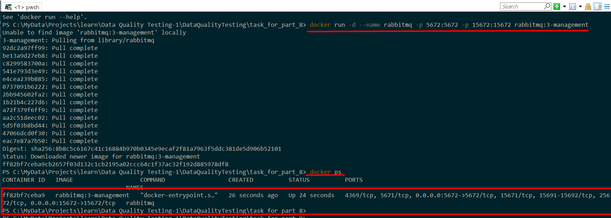

2) Запустите класс, дождитесь надписи 'Execution finished' в стандартном выводе.  

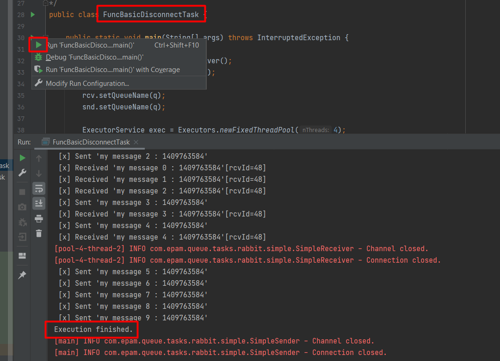

3) Проверьте состояние очереди 'query-name-1'. Сколько сообщений ушло, сколько осталось (если осталось).  
Для выполнения данного задания понадобится доступ в консоль:  
```
docker container exec -it rabbitmq /bin/sh  
```
```
rabbitmqctl list_queues messages_ready  
```
10 сообщений отправлено, 5 принято, 5 осталось  

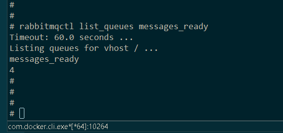

4) Перезапустите контейнер с брокером. Проверьте состояние очереди. Сохранилось ли ее состояние? Почему сохранилось/не сохранилось?  

```
docker restart rabbitmq 
docker container exec -it rabbitmq /bin/sh  
rabbitmqctl list_queues messages_ready  
```

Состояние очереди сохранилось т.к. сообщения отправлялись без флагов.

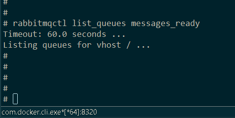

### 2. Цель: знакомство с ack.  

com.epam.queue.tasks.rabbit.queue.tasks.FuncPersistDisconnectTask  

1) запустите брокер в докере:  
```
docker run -d --name rabbitmq -p 5672:5672 -p 15672:15672 rabbitmq:3-management  
```


2) Запустите класс, дождитесь надписи 'Execution finished' в стандартном выводе.  

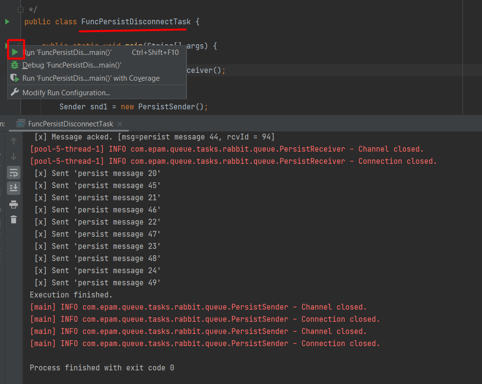

3) Проверьте состояние очереди 'pers-query-1'. Сколько сообщений ушло, сколько осталось (если осталось).  
Для выполнения данного задания понадобится доступ в консоль:  
```
docker container exec -it rabbitmq /bin/sh  
```
```
rabbitmqctl list_queues messages_ready  
```
50 сообщений отправлено, 40 принято, 10 осталось  

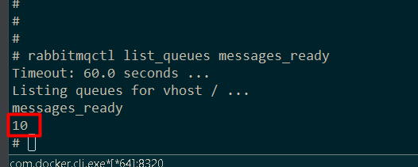

4) Перезапустите контейнер с брокером. Проверьте состояние очереди. Сохранилось ли ее состояние? Почему сохранилось/не сохранилось?  

```
docker restart rabbitmq 
docker container exec -it rabbitmq /bin/sh  
rabbitmqctl list_queues messages_ready  
```
Состояние очереди сохранилось т.к. сообщения отправлялись с флагом MessageProperties.PERSISTENT_TEXT_PLAIN  

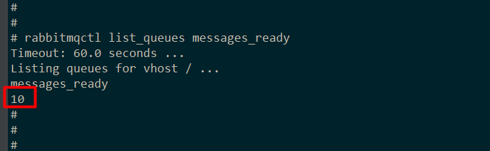  

### 3. Цель: знакомство с round-robin.  

com.epam.queue.tasks.rabbit.queue.tasks.FuncRoundRobinTask  

1) запустите брокер в докере:  
```
docker run -d --name rabbitmq -p 5672:5672 -p 15672:15672 rabbitmq:3-management  
```

2) Запустите класс, дождитесь надписи 'Execution finished' в стандартном выводе.  

3) Посмотрите на сообщения в стандартном выводе.  
   а) Какой получатель (id) начал обработку (прием) сообщений?  

Начал прием сообщений приемник с id = 24.

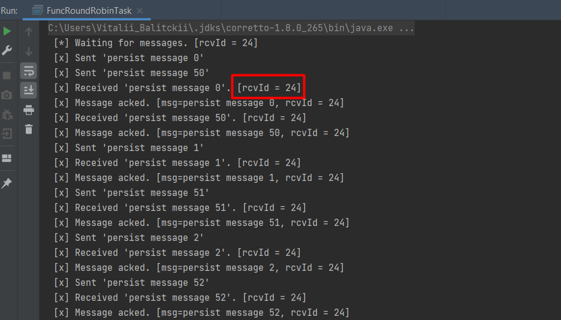  

   б) Какой получатель (id) завершил обработку (прием) сообщений?  

Завершил прием сообщений приемник с id = 9. Т.к. прежде чем принимать находился в 25-секундном ожидании.  

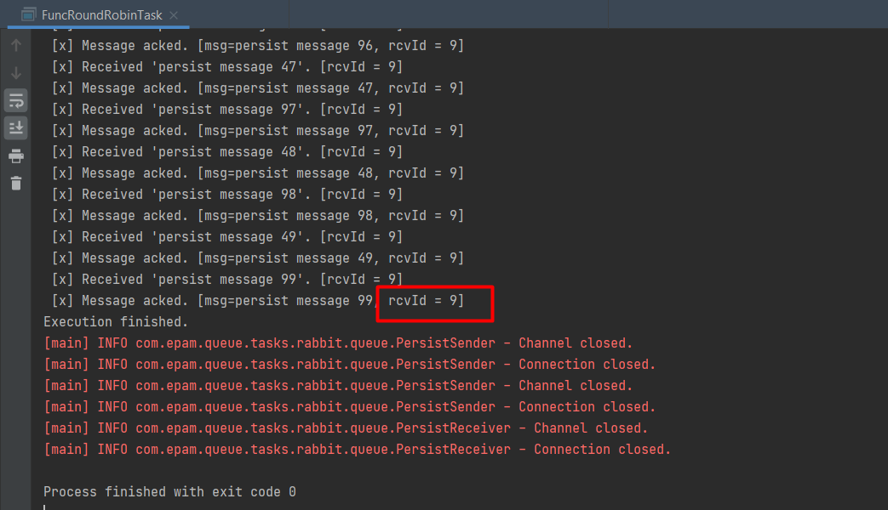  

   в) Почему какой-то промежуток времени сообщения никем не обрабатывались?  
   
1-й приемник (id = 9) начал работу сразу после запуска программы.  
1-й приемник (id = 9) обрабатывал сообщения 10 секунд. Обработал 40 сообщений.  
1-й приемник (id = 9) закрылся через 10 секунд.  
Пауза 15 секунд.  
2-й приемник (id = 24) начал работу после 25 секунд ожидания.  
2-й приемник (id = 24) обрабатывал сообщения. Обработал 60 сообщений.  
2-й приемник (id = 24) закрылся.  

# Очереди, AMQP, задания для автоматизированного тестирования.  

### 1. com.epam.queue.task.ImplementReceiverTaskIT  

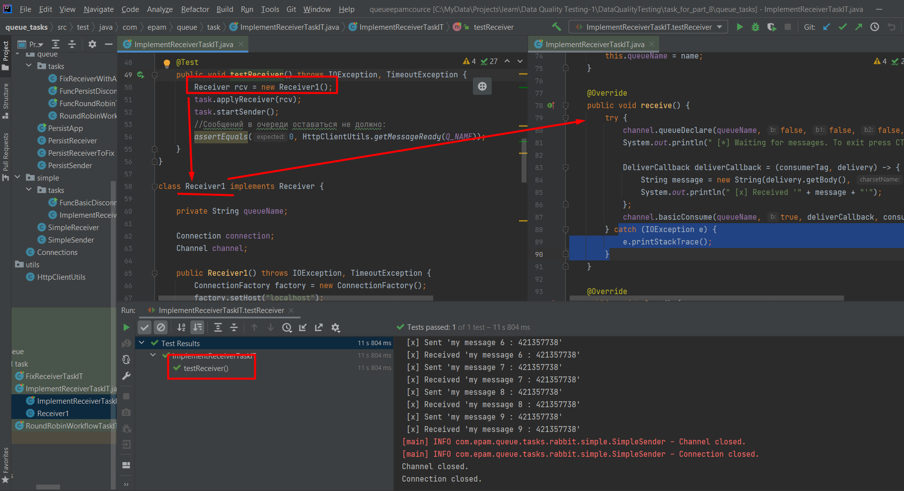  

### 2. com.epam.queue.task.FixReceiverTaskIT  

Т.к. потребитель настроен на надежную доставку в случае падения в методе
```
            boolean durable = true;
            channel.queueDeclare(queueName, durable, false, false, null);
```
мы должны отключить автоматическую отправку подтверждений потребителем
```
            boolean autoAck = false;
            channel.basicConsume(queueName, autoAck, deliverCallback, consumerTag -> {});
```

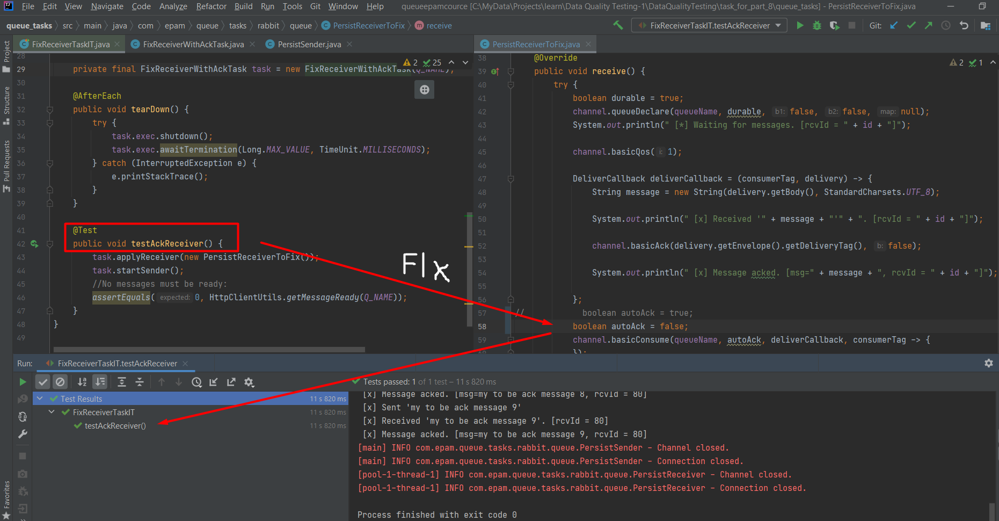  

### 3. com.epam.queue.task.RoundRobinWorkflowTaskIT  

- в методе init настраиваются три объекта
	- отправитель rcv1 - принимает 10 секунд, потом отключается
	- 1й приемник snd1 - отправляет 25 сообщений через 500 мс каждое, т.е отправка идет 12.5 секунд
	- 2й приемник snd2 - отправляет 25 сообщений через 400 мс каждое, т.е отправка идет 10 секунд
- поэтому приемник не успевает забрать все сообщения из очереди т.к. 10 < 12.5
- для того чтобы забрать все оставшиеся сообщения нужно запустить еще один приемник

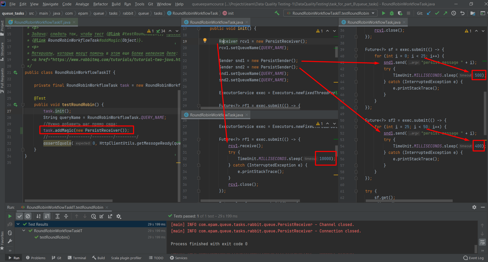  

